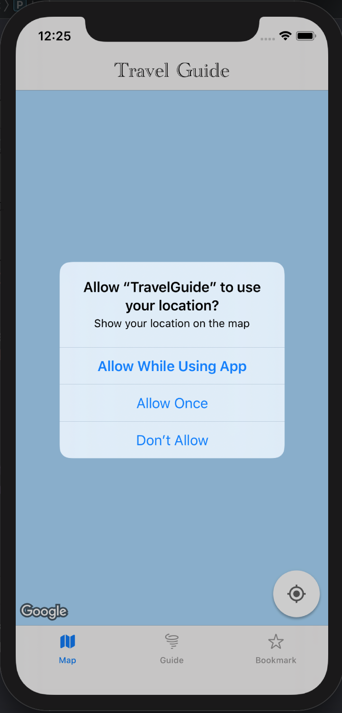
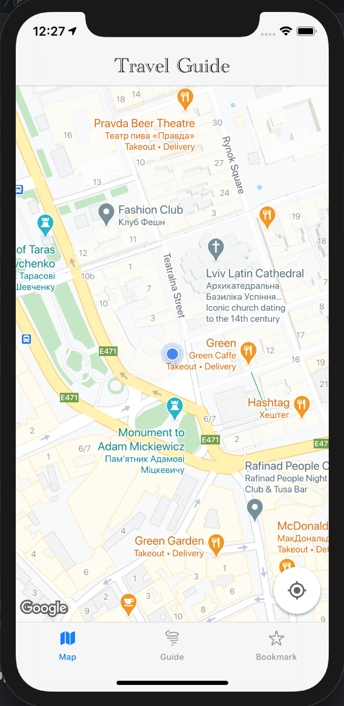
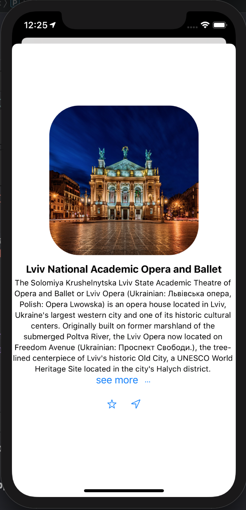

# TravelGuide-SwiftUI 

This is a short travel guide application for Ukraine(Lviv city).  Welcomes to Ukraine! Here you can find a lot of beautiful places with huge history and with friendly people.

For the development I used: 

   1. Google Maps Platform - https://developers.google.com/maps/documentation/ios-sdk/overview
   2. CocoaPods - https://guides.cocoapods.org/using/getting-started.html
   3. SwiftUI - https://developer.apple.com/xcode/swiftui/
   
   ,   , , 
   
For the study, you can learn how to use google maps with cocopods framework and of course SwiftUI which is awsome.
