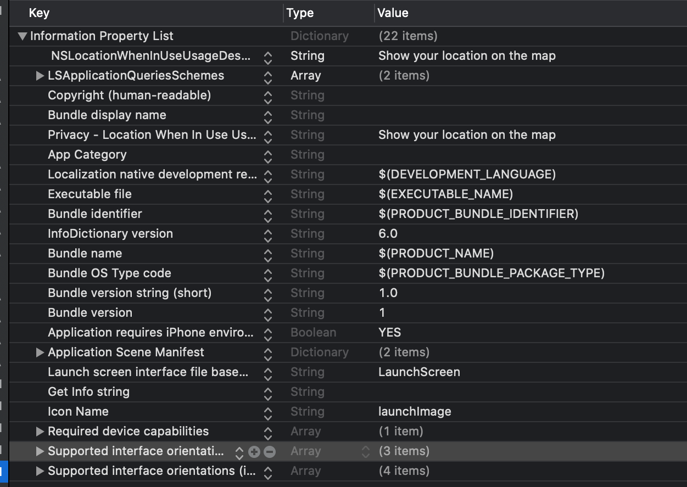
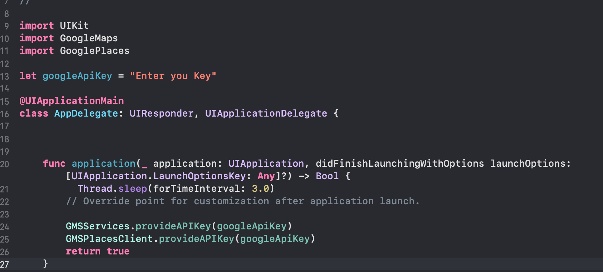

# Travel Guide 

#### This is a short Travel Guide application for Ukraine(Lviv city).  Welcome to Ukraine!

 ####     

## Coding
#### For the development I used:
#### Google Maps Platform - https://developers.google.com/maps/documentation/ios-sdk/overview
#### CocoaPods - https://guides.cocoapods.org/using/getting-started.html
#### SwiftUI - https://developer.apple.com/xcode/swiftui/

## How to Use:
### 1. Set-up the Info.plist
#### Privacy - Location When In Use Usage Description
#### 
### 2. Getting an Google API Key before start
#### Link to the guide - https://developers.google.com/maps/documentation/ios-sdk/get-api-key?authuser=1
#### AppDelegate.swift - enter your key
#### 
### 3. Installing the SDK
#### The Maps SDK for iOS is available as a CocoaPods pod. CocoaPods is an open source dependency manager for Swift and Objective-C Cocoa projects.
#### CocoaPods for google maps getting started guide - https://developers.google.com/maps/documentation/ios-sdk/start?authuser=1
