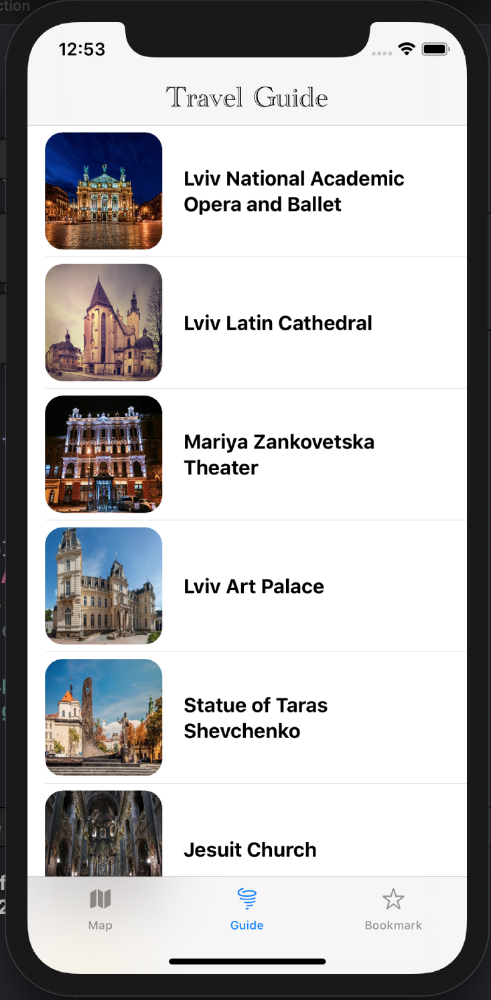

# Travel Guide 
#### Video Demo:  <https://www.youtube.com/watch?v=kgcLC33L3pc>
#### Description:
#### This is a short Travel Guide application for Ukraine(Lviv city).  Welcome to Ukraine!
#### The purpose of this project is to invite people to Ukraine, to tell about it. Ukraine is a country in the center of Europe with its melodious language, history, traditions, and the best people.

 ####     

## Coding
#### For the development I used:
#### Google Maps Platform - https://developers.google.com/maps/documentation/ios-sdk/overview
#### CocoaPods - https://guides.cocoapods.org/using/getting-started.html
#### SwiftUI - https://developer.apple.com/xcode/swiftui/

#### How to Use:
#### 1. Set-up the Info.plist
#### Privacy - Location When In Use Usage Description
#### 
#### 2. Getting an Google API Key before start
#### Link to the guide - https://developers.google.com/maps/documentation/ios-sdk/get-api-key?authuser=1
#### AppDelegate.swift - enter your key
#### 
#### 3. Installing the SDK
#### The Maps SDK for iOS is available as a CocoaPods pod. CocoaPods is an open source dependency manager for Swift and Objective-C Cocoa projects.
#### CocoaPods for google maps getting started guide - https://developers.google.com/maps/documentation/ios-sdk/start?authuser=1
#### About the files:
#### My project include two main folders with files: Model, View.
#### Models: 
#### 1. LocationManager.swift - The model for tracking current user’s location (latitude and longitude). 
#### 2. Plase.swift - The model what include all information about places for the traveling.
#### 3. ShowModal.swift - The model for the Sheet View UI. How the sweet look like then you open the detailed places info(toogle).

#### View:
#### GoogleMaps.swift - The view for google maps style.
#### GuideView.swift - The view for the information about places - location, detailed info, ets.
#### MapView.swift - The view for google maps in the tab bar.
#### TabBarButton.swift - The view for all  tab bar buttons. Each tab has they own view as well.

#### 1. Style.json - In this file I created my own view for google maps.
#### PodFile - The Podfile is a specification that describes the dependencies of the targets of one or more Xcode projects. 
#### Assets.xcassets - The all photo files for the project. 
#### For the design I used icon, logo -  the map of my country. 

#### During writing this project I've learn how to use google maps with cocopods framework and of course SwiftUI which is awsome.

